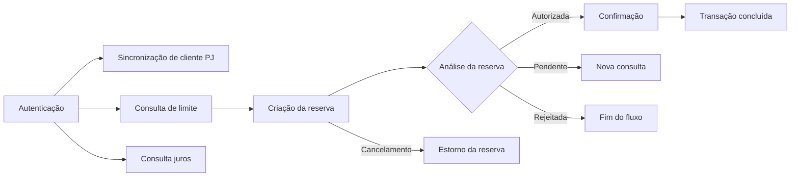

# REST VTEX (2.5.0) — Documentação da API de Crédito

[](https://www.openapis.org/)
[](https://redocly.com/)

Documentação da API responsável pela integração de operações de crédito entre o **ERP TOTVS Protheus** e o **e-commerce VTEX**.

A especificação foi construída no padrão **OpenAPI 3.0.3** e publicada com o **Redocly**, oferecendo uma referência centralizada para autenticação, consulta de limite, criação de reserva e acompanhamento do ciclo financeiro de uma transação.

> [!IMPORTANT]
> Esta API é destinada ao uso interno e por integrações autorizadas. O acesso aos endpoints protegidos exige uma chave de API e um token Bearer válidos.

---

## Visão geral

A API disponibiliza os recursos necessários para controlar o fluxo de crédito utilizado no checkout da VTEX:

1. autenticação do consumidor da API;
2. consulta do limite de crédito do cliente;
3. criação de uma reserva de crédito;
4. consulta da autorização da transação;
5. confirmação da reserva;
6. cancelamento e estorno da transação.

### Fluxo da transação



---

## Endpoints

| Método | Rota | Descrição |
|---|---|---|
| `POST` | `/api/oauth2/v1/token` | Gera o token de autenticação da integração. |
| `GET` | `/vtex/creditLimit/{document}` | Consulta o limite e o saldo disponível do cliente pelo CPF ou CNPJ. |
| `PATCH` | `/vtex/customer` | Cria ou atualiza o cadastro de um cliente pessoa jurídica no ERP. Também utilizado para solicitar uma análise de crédito para o cliente. |
| `POST` | `/vtex/creditReserve` | Realiza a reserva de um valor no limite de crédito. |
| `GET` | `/vtex/authorization/{customerId}/reserve/{id}` | Consulta o status da autorização de uma reserva. |
| `POST` | `/vtex/confirmation/{customerId}/reserve/{id}` | Confirma uma transação previamente autorizada. |
| `POST` | `/vtex/cancellation/{customerId}/reserve/{id}` | Cancela a transação e estorna o valor reservado. |

### Status da reserva

Uma reserva pode assumir os seguintes estados:

| Status | Significado |
|---|---|
| `pending` | A reserva foi criada e ainda aguarda análise ou processamento. |
| `authorized` | O valor foi reservado e a transação está autorizada. |
| `confirmed` | A transação foi concluída e confirmada. |
| `canceled` | A reserva foi cancelada e o valor foi estornado. |
| `rejected` | A transação foi analisada e rejeitada por regra de negócio. |

---

## Autenticação

Os endpoints protegidos utilizam duas camadas de autenticação:

- **API Key**, enviada no header `x-api-key`;
- **Bearer Token**, obtido pelo endpoint de autenticação.

### Gerar o token

```bash
curl --request POST \
  --url 'https://wkrtswcddl.execute-api.us-east-2.amazonaws.com/vtex/rest/api/oauth2/v1/token' \
  --header 'Content-Type: application/x-www-form-urlencoded' \
  --data-urlencode 'username=SEU_USUARIO' \
  --data-urlencode 'password=SUA_SENHA' \
  --data-urlencode 'grant_type=password'
```

### Consumir um endpoint protegido

```bash
curl --request GET \
  --url 'https://wkrtswcddl.execute-api.us-east-2.amazonaws.com/vtex/rest/vtex/creditLimit/00000000000' \
  --header 'Authorization: Bearer SEU_TOKEN' \
  --header 'x-api-key: SUA_CHAVE_DE_API'
```

> [!CAUTION]
> Nunca publique chaves, usuários, senhas ou tokens reais no repositório. Use variáveis de ambiente ou o gerenciador de segredos do ambiente de implantação.

---

## Estrutura do projeto

```text
.
├── rest-vtex.yaml   # Especificação OpenAPI da API
├── redocly.yaml     # Configurações, regras de lint e publicação
└── README.md        # Documentação do repositório
```

### `rest-vtex.yaml`

Contém a definição completa da API:

- informações gerais e versão;
- servidor de produção;
- rotas e operações;
- parâmetros de entrada;
- schemas de request e response;
- exemplos de retorno;
- métodos de autenticação;
- agrupamento dos endpoints por tags.

### `redocly.yaml`

Centraliza as configurações utilizadas pelo Redocly:

- arquivo OpenAPI principal;
- conjunto de regras de validação;
- validação dos exemplos definidos nos schemas;
- padronização dos títulos e resumos;
- desativação do servidor de simulação;
- exclusão de arquivos que não devem participar da validação.

---

## Executando localmente

### Pré-requisitos

- [Node.js](https://nodejs.org/) compatível com a versão atual do Redocly CLI;
- npm ou outro gerenciador de pacotes compatível;
- Redocly CLI, instalado localmente ou executado via `npx`.

### 1. Clonar o repositório

```bash
git clone <URL_DO_REPOSITORIO>
cd <NOME_DO_REPOSITORIO>
```

### 2. Validar a especificação

```bash
npx @redocly/cli lint rest-vtex.yaml
```

O comando aplica as regras configuradas no `redocly.yaml` e aponta inconsistências na especificação, nos schemas e nos exemplos.

### 3. Gerar a documentação estática

```bash
npx @redocly/cli build-docs rest-vtex.yaml --output docs/index.html
```

O resultado será um arquivo HTML estático que pode ser publicado em qualquer servidor web ou no GitHub Pages.

### 4. Visualizar no navegador

Abra o arquivo gerado:

```text
docs/index.html
```

Também é possível utilizar uma extensão de servidor local, como o **Live Server** do VS Code, para visualizar a documentação durante o desenvolvimento.

---

## Validação e qualidade

O projeto utiliza regras do Redocly para manter a documentação consistente e evitar divergências entre contrato e implementação.

Entre as validações aplicadas estão:

- toda operação deve utilizar uma tag declarada;
- exemplos devem respeitar os schemas definidos;
- media types precisam ser válidos;
- propriedades escalares devem possuir exemplos;
- resumos de operações e exemplos devem seguir o padrão de capitalização definido no projeto.

Antes de abrir um Pull Request, execute:

```bash
npx @redocly/cli lint rest-vtex.yaml
```

A alteração só deve ser enviada após a correção dos erros reportados pelo lint.

---

## Publicação no GitHub Pages

Uma forma simples de hospedar a documentação é gerar o HTML estático dentro da pasta `docs` e habilitar o GitHub Pages.

```bash
mkdir -p docs
npx @redocly/cli build-docs rest-vtex.yaml --output docs/index.html
```

Depois:

1. envie a pasta `docs` para o repositório;
2. acesse **Settings → Pages**;
3. em **Build and deployment**, selecione a publicação a partir de uma branch;
4. escolha a branch principal e a pasta `/docs`;
5. salve a configuração.

Após a publicação, o GitHub disponibilizará uma URL pública para a documentação.

---

## Convenções do projeto

Ao criar ou alterar um endpoint:

1. mantenha o `operationId` único;
2. utilize uma tag já declarada ou registre uma nova tag;
3. documente todos os parâmetros obrigatórios;
4. defina exemplos válidos para requests e responses;
5. reutilize schemas em `components/schemas` sempre que possível;
6. descreva claramente os cenários de sucesso e erro;
7. atualize a versão da API quando houver alteração de contrato;
8. execute o lint antes de enviar a mudança.

### Versionamento

A versão da documentação está disponível em:

```yaml
info:
  version: 1.5.0
```

Recomenda-se seguir o padrão de **Versionamento Semântico**:

- `MAJOR`: alteração incompatível no contrato;
- `MINOR`: inclusão compatível de funcionalidades;
- `PATCH`: correção ou melhoria sem alteração funcional incompatível.

---

## Contribuição

1. crie uma branch a partir da branch principal;
2. altere a especificação OpenAPI;
3. execute o lint localmente;
4. revise os exemplos e schemas afetados;
5. abra um Pull Request descrevendo a mudança e o impacto no contrato.

Exemplo:

```bash
git checkout -b docs/adiciona-novo-endpoint
npx @redocly/cli lint rest-vtex.yaml
git add .
git commit -m "docs: adiciona novo endpoint"
git push origin docs/adiciona-novo-endpoint
```

---

## Suporte

Em caso de dúvidas, inconsistências na documentação ou falhas na integração, entre em contato com a equipe responsável:

**Suporte TI**  
`suporteti@comercialqueiroz.com.br`

Ao abrir uma solicitação, informe sempre que possível:

- endpoint utilizado;
- método HTTP;
- horário aproximado da requisição;
- status code recebido;
- corpo da resposta;
- identificador do pedido, cliente ou transação;
- evidências sem dados sensíveis.

---

## Licença e uso

Este projeto contém documentação técnica de uma integração corporativa. Seu uso, distribuição e acesso devem seguir as políticas internas da organização.
